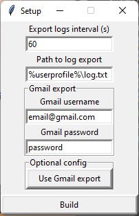

# Python Keylogger

This program is a simple keylogger written in python3.

## Installation

This program requires:
* [Python3](https://www.python.org/downloads/) (Make sure to add python to PATH during installation)

1. Download the repository using GitHub or git.
2. Install the modules by running `python -m pip install -r requirements.txt`

## Usage

1. Navigate to `src` and right-click while holding shift to open terminal or powershell
2. Run `python setup.pyw` to build the .exe.
3. Open the `dist` folder and run the compiled .exe.

> Env Variables such as `%userprofile%` and `%tmp%` are allowed in the log path. Also, if sending logs to a gmail account, that account must have allowed access for less secure apps.

> Enter `shift+F1` or kill the program
